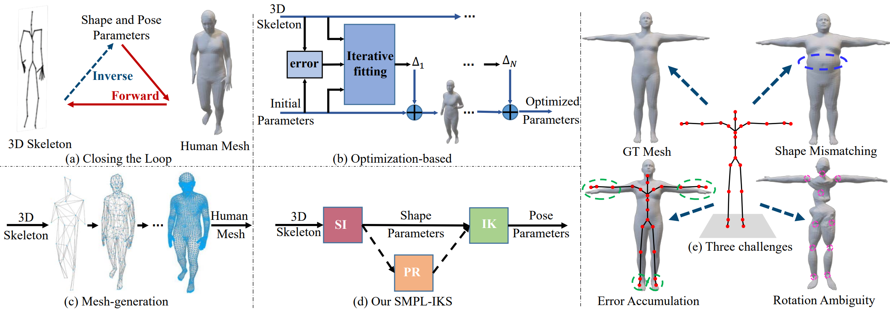

# SMPL-IKS: An Inverse Kinematic Solver for 3D Human Mesh Recovery

This repository is the official implementation of [SMPL-IKS: An Inverse Kinematic Solver for 3D Human Mesh Recovery]. 

## Key idea: Shape Inverse + Pose Refinement + Inverse Kinematics

<div align="center">
    <br>
    3D Skeleton-to-Mesh
</div>

## Requirements

To install requirements:

```setup
#1. Create a conda virtual environment.
  conda create -n smpliks python=3.6.10
  conda activate smpliks

#2. Install requirements.
  pip install -r requirements.txt
```

## Preparing Data and Rre-trained model
1. Download the required data.
   * Download our data and pre-trained model [SMPL] from [Google Drive](https://drive.google.com/drive/folders/1Ek2LEyOYCjqah4ZTHWSBWxsG6OTpiz-I?usp=drive_link) 
   * Download our data and pre-trained model [SMPLX] from [Google Drive](https://drive.google.com/drive/folders/1FDOP-wUYLOBLtNDfvalDnz9KjBRpxNGx?usp=drive_link)
     
   
2. You need to follow directory structure of the `data` as below.
```
|-- data
    `-- |-- smpl  
        `-- |-- smpliks_db
            `-- |-- amass_train_db.pt
            `-- |-- amss_test_db.pt
            `-- |-- 3dpw_test_db.pt
            `-- |-- agora_test_db.pt
        `-- |-- smpliks_data
            `-- |-- SMPL_NEUTRAL.pkl
            `-- |-- smpl_kid_template.npy
            `-- |-- skeleton_2_beta_smpl.npz
        `-- |-- pretrained_model
            `-- |-- model_best.pth.tar
    `-- |-- smplx  
        `-- |-- smpxliks_db
            `-- |-- amass_train_db.pt
            `-- |-- amss_test_db.pt
            `-- |-- motionx_test_db.pt
            `-- |-- agora_test_db.pt
        `-- |-- smplxiks_data
            `-- |-- SMPLX_NEUTRAL.npz
            `-- |-- smplx_kid_template.npy
            `-- |-- skeleton_2_beta_smplx.npz
        `-- |-- pretrained_model
            `-- |-- model_best.pth.tar
```
3. You need to modify the [ROOT_PATH]:
```setup
For SMPL
  #1. vim lib/core/smpl/config.py
  #2. you should modify the ROOT_PATH = <Your path>
```
```setup
For SMPLX
  #1. vim lib/core/smplx/config.py
  #2. you should modify the ROOT_PATH = <Your path>
```
## Training

To train our Part-aware Network (PAN) in the paper, run this command:

```train
For SMPL
  python train_smpl.py --cfg configs/smpl/config_train.yaml
```
```train
For SMPLX
  python train_smplx.py --cfg configs/smplx/config_train.yaml
```
## Evaluation

To evaluate our SI+PR-C+AnalyIK(Twist removal) or SI+PR-C+MixIK, run:

```eval
For SMPL
python eval_smpl.py --cfg configs/smpl/config_eval.yaml
```

```eval
For SMPLX
python eval_smplx.py --cfg configs/smplx/config_eval.yaml
```

You can evaluate on different datasets by modifying:

```eval
For SMPL
  #1. vim configs/smpl/config_eval.yaml
  #2. you should modify the DATASET_EVAL: 'AGORA' or 'AMASS' or 'ThreeDPW'
```

```eval
For SMPLX
  #1. vim configs/smplx/config_eval.yaml
  #2. you should modify the DATASET_EVAL: 'AGORA' or 'AMASS' or 'MOTIONX'
```

## Results

Our model achieves the following performance:

For SMPL

| Methods            |MPBE(AMASS)|MPJPE(AMASS)|MPVE(AMASS)|MPBE(3DPW)|MPJPE(3DPW)|MPVE(3DPW)|MPBE(AGORA)|MPJPE(AGORA)|MPVE(AGORA)|
| -------------------|-----------|------------|-----------|----------|-----------|----------|-----------|------------|-----------|
| SI+PR-C+AnalyIK(Twist removal)   |   0.1mm  |     0.3mm |    15.7mm |   0.0mm  |    0.2mm  |   14.2mm |    0.1mm  |     0.2mm  |   23.8mm  |            
| SI+PR-C+MixIK                   |   0.1mm  |     0.3mm |    11.6mm  |   0.0mm |    0.2mm  |   10.8mm |    0.1mm  |     0.2mm  |   19.4mm  |  


For SMPLX

| Methods            |MPBE(AMASS)|MPJPE(AMASS)|MPVE(AMASS)|MPBE(MOTIONX)|MPJPE(MOTIONX)|MPVE(3DPW)|MPBE(AGORA)|MPJPE(AGORA)|MPVE(AGORA)|
| -------------------|-----------|------------|-----------|----------|-----------|----------|-----------|------------|-----------|
| SI+PR-C+AnalyIK(Twist removal)     |   0.3mm   |     0.5mm  |    16.9mm |   0.3mm  |    0.5mm  |   15.6mm |    0.3mm  |     0.5mm  |   16.8mm  |            
| SI+PR-C+MixIK                     |   0.3mm   |     0.5mm  |    13.9mm  |   0.3mm  |    0.5mm  |   14.4mm |    0.3mm  |     0.5mm  |   13.9mm  |  


## License
By downloading and using this code you agree to the terms in the [LICENSE](LICENSE). Third-party datasets and software are subject to their respective licenses.

